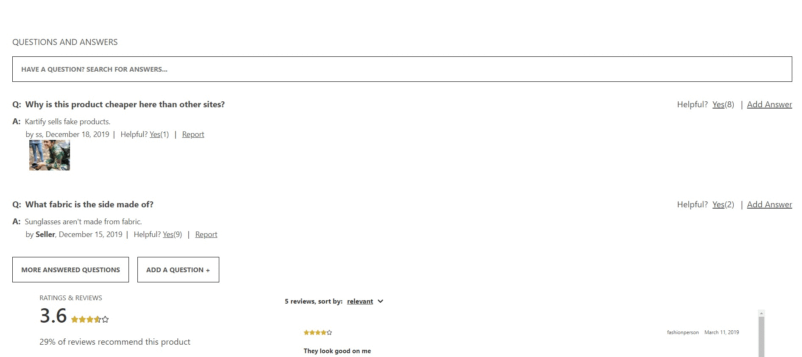
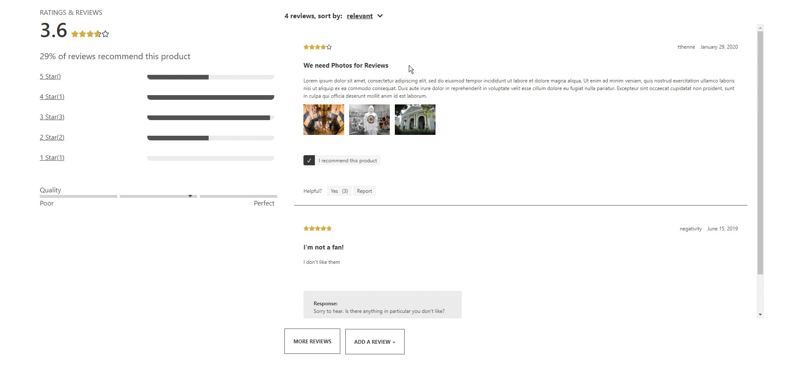

# CartIt
### E-commerce apparel website built with React & Redux

#### Table of Contents

  - Overview
  - Product Overview
  - Related Items
  - Your Outfit Section
  - Questions and Answers
  - Ratings and Reviews
  - Start Instructions
  - Dependencies

#### Overview
A user can browse for products, select a product and view the product's pictures, Q&As about the product, and the reviews for that product. 

#### Product Overview
  - User sees the main picture of the product
  - Thumbnails below main picture allow you to click and load different photos of the product
  - To the right the user has the options to select different styles, sizes, and quantity.

#### Related Items Section
  - Below the Product Overview a user can see a list cards of similar/related products.
  - Click on the star icon on any card will load that product

#### Your Outfit Section
  - Functions like a cart system
  - Clicking "Add to Cart" will add a product here

#### Questions and Answers
  Users can:
  - View all the questions and answers that have been posted to a product page
  - Search for a specific question/answer via keyword
  - Ask a question
  - Answer a question
  - Upvote questions/answers or report answers 

#### Ratings and Reviews
  Users can:
  - Write reviews and upload photos to go along with their reviews
  - View/rate the product on a scale of 1-5 
  - Also view/report a product's characteristics on a scale such as "Fit", "Length", and "Comfort"

## Start instructions
1) npm install
2) npm start
## A list of Dependencies and their intended use.
1)**React-router-dom:** - Declarative routing for React

2)**Bulma:** - A Pure CSS framework used for styling and structuring website components.

3)**ESLint:** - Pluggable JavaScript linter - tool for identifying and reporting on patterns in JavaScript

4)**Enzyme:** - Testing utility for React

5)**Jest:** - Also a testing utility used for unit tests.

